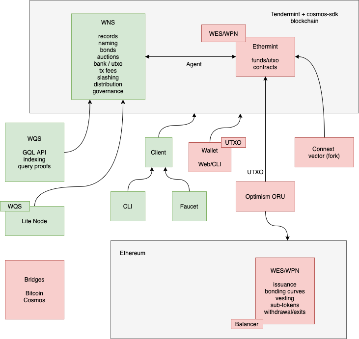

## WNS

### Features

* IPLD compat graph database
  * Record bonds
* Naming
  * Authority auctions
  * Authority bonds
* Tx fees
* Slashing
* Governance

### Tech

* Golang, cosmos-sdk, IPLD

## WQS

### Features

* Indexer
* GQL API
* Query proofs

### Tech

* Golang
* GQL

## WES/WPN

### Tokens / Payment

#### Features

* Issuance
* Bonding curves
* Vesting
* Exits
* Sub tokens

#### Tech

* Ethereum
* Solidity
* Balancer
* Ethermint
* Optimism ORU
* Connext

## WNS Lite

### Tech

* cosmos-sdk
* Light clients

## Client

### Tech

* JS

## CLI

### Tech

* NodeJS

## Faucet

### Tech

* NodeJS

## Wallet

### Tech

* Browser extensions
* JS
